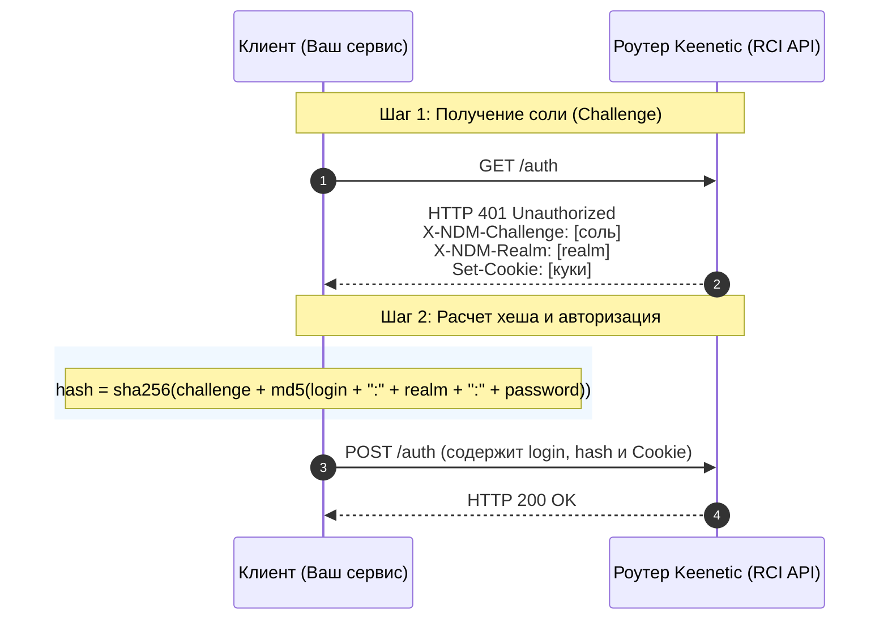

# Спецификация аутентификации Keenetic RCI API

Данный документ описывает протокол аутентификации Keenetic RCI (Remote Control Interface), использующий схему Challenge-Response (запрос-ответ) через MD5 и SHA-256. Описание подготовлено на основе реализации в проекте `awg-manager` для последующего переноса в другие проекты.

---

## 1. Общее описание протокола

Аутентификация Keenetic RCI выполняется поверх протокола HTTP(S) и состоит из двух шагов:
1. **Запрос вызова (Challenge Request)**: Клиент отправляет пустой GET-запрос и получает от роутера соль (состязание) и область видимости (realm) в заголовках `401 Unauthorized`.
2. **Отправка подтверждения (Response Submission)**: Клиент хеширует пароль с использованием соли и отправляет POST-запрос с именем пользователя и полученным хешем. В ответ роутер присылает куки сессии (в случае успешной авторизации).



---

## 2. Пошаговый алгоритм

### Шаг 1. Получение параметров вызова
Отправьте HTTP-запрос методом **GET** на адрес роутера:
* **URL**: `http://<router_ip>:<port>/auth`
* **Метод**: `GET`

#### Обработка ответа:
* **Код `200 OK`**: Авторизация отключена в настройках роутера или клиент уже авторизован. Дополнительных действий не требуется.
* **Код `401 Unauthorized`**: Требуется авторизация. Извлеките следующие заголовки и куки:
  * Заголовок `X-NDM-Challenge` (строка вызова, например: `9d863f683bb5fca3...`).
  * Заголовок `X-NDM-Realm` (обычно имя роутера или `"Keenetic"`, например: `Keenetic Giga`).
  * Куки из заголовка `Set-Cookie` (обязательно сохранить для передачи на следующем шаге).
* **Любой другой код**: Ошибка подключения или несовместимое устройство.

---

### Шаг 2. Вычисление хеша пароля
Расчет производится на стороне клиента по формуле:

$$\text{hashedPassword} = \text{SHA256}(\text{Challenge} + \text{MD5}(\text{Login} + \text{":"} + \text{Realm} + \text{":"} + \text{Password}))$$

> [!IMPORTANT]
> Результаты хешей MD5 и SHA-256 должны быть представлены в виде шестнадцатеричных строк (hex) в **нижнем регистре**.

#### Пример расчета:
* **Login**: `admin`
* **Password**: `123456`
* **Realm**: `Keenetic`
* **Challenge**: `4f91b7d5`
1. Формируем строку MD5: `admin:Keenetic:123456`
2. Вычисляем MD5: `md5("admin:Keenetic:123456") = f89ef06a7bc07b...` (hex-строка)
3. Формируем строку SHA-256: `4f91b7d5f89ef06a7bc07b...`
4. Вычисляем SHA-256: `sha256("4f91b7d5f89ef06a7bc07b...")` $\rightarrow$ это и есть `hashedPassword`.

---

### Шаг 3. Отправка подтверждения
Отправьте HTTP-запрос методом **POST**:
* **URL**: `http://<router_ip>:<port>/auth`
* **Заголовки**:
  * `Content-Type: application/json`
  * `Cookie: [куки, полученные на Шаге 1]`
* **Тело запроса (JSON)**:
  ```json
  {
    "login": "<имя_пользователя>",
    "password": "<вычисленный_hashedPassword>"
  }
  ```

#### Обработка ответа:
* **Код `200 OK`**: Успешная авторизация.
* **Код `401 Unauthorized`**: Неверный логин или пароль.
* **Другие коды**: Системная ошибка.

---

## 3. Эталонная реализация на языке Go

Ниже приведен готовый модуль для интеграции, написанный на основе исходного кода проекта `awg-manager` ([keenetic.go](file:///d:/python/awgm/internal/auth/keenetic.go)).

```go
package auth

import (
	"bytes"
	"context"
	"crypto/md5"
	"crypto/sha256"
	"encoding/hex"
	"encoding/json"
	"errors"
	"fmt"
	"net/http"
	"strings"
	"time"
)

var (
	ErrInvalidCredentials = errors.New("invalid credentials")
	errAuthDisabled       = errors.New("auth disabled")
)

type KeeneticClient struct {
	httpClient *http.Client
}

func NewKeeneticClient(timeout time.Duration) *KeeneticClient {
	return &KeeneticClient{
		httpClient: &http.Client{
			Timeout: timeout,
			CheckRedirect: func(req *http.Request, via []*http.Request) error {
				// Запрещаем автоматический редирект
				return http.ErrUseLastResponse
			},
		},
	}
}

// Authenticate выполняет проверку логина и пароля на роутере Keenetic.
// routerAddr должен быть в формате "IP:port" или "IP" (например, "192.168.1.1:80").
func (c *KeeneticClient) Authenticate(ctx context.Context, routerAddr, login, password string) error {
	authURL := fmt.Sprintf("http://%s/auth", routerAddr)

	// Шаг 1: GET /auth для получения Challenge, Realm и Cookies
	challenge, realm, cookies, err := c.getChallenge(ctx, authURL)
	if err != nil {
		if errors.Is(err, errAuthDisabled) {
			return nil // Авторизация не требуется
		}
		return fmt.Errorf("failed to get challenge: %w", err)
	}

	// Шаг 2: Вычисление хеша пароля
	hashedPassword := c.hashPassword(login, password, realm, challenge)

	// Шаг 3: POST /auth для подтверждения
	if err := c.postAuth(ctx, authURL, login, hashedPassword, cookies); err != nil {
		return err
	}

	return nil
}

func (c *KeeneticClient) getChallenge(ctx context.Context, authURL string) (challenge, realm string, cookies []*http.Cookie, err error) {
	req, err := http.NewRequestWithContext(ctx, http.MethodGet, authURL, nil)
	if err != nil {
		return "", "", nil, err
	}

	resp, err := c.httpClient.Do(req)
	if err != nil {
		return "", "", nil, err
	}
	defer resp.Body.Close()

	if resp.StatusCode == http.StatusOK {
		return "", "", nil, errAuthDisabled
	}

	if resp.StatusCode != http.StatusUnauthorized {
		return "", "", nil, fmt.Errorf("unexpected status code: %d", resp.StatusCode)
	}

	challenge = strings.TrimSpace(resp.Header.Get("X-NDM-Challenge"))
	realm = strings.TrimSpace(resp.Header.Get("X-NDM-Realm"))

	if challenge == "" || realm == "" {
		return "", "", nil, fmt.Errorf("missing auth headers")
	}

	return challenge, realm, resp.Cookies(), nil
}

func (c *KeeneticClient) hashPassword(login, password, realm, challenge string) string {
	// MD5(login:realm:password)
	md5Input := fmt.Sprintf("%s:%s:%s", login, realm, password)
	md5Hash := md5.Sum([]byte(md5Input))
	md5Hex := hex.EncodeToString(md5Hash[:])

	// SHA256(challenge + md5Hex)
	sha256Input := challenge + md5Hex
	sha256Hash := sha256.Sum256([]byte(sha256Input))
	return hex.EncodeToString(sha256Hash[:])
}

func (c *KeeneticClient) postAuth(ctx context.Context, authURL, login, hashedPassword string, cookies []*http.Cookie) error {
	payload := map[string]string{
		"login":    login,
		"password": hashedPassword,
	}

	bodyBytes, err := json.Marshal(payload)
	if err != nil {
		return err
	}

	req, err := http.NewRequestWithContext(ctx, http.MethodPost, authURL, bytes.NewReader(bodyBytes))
	if err != nil {
		return err
	}
	req.Header.Set("Content-Type", "application/json")

	// Передаем куки с предыдущего шага
	for _, cookie := range cookies {
		req.AddCookie(cookie)
	}

	resp, err := c.httpClient.Do(req)
	if err != nil {
		return err
	}
	defer resp.Body.Close()

	if resp.StatusCode == http.StatusUnauthorized {
		return ErrInvalidCredentials
	}
	if resp.StatusCode != http.StatusOK {
		return fmt.Errorf("auth post failed with status: %d", resp.StatusCode)
	}

	return nil
}
```

---

## 4. Рекомендации по интеграции в продакшен

1. **Таймауты (Timeouts)**: Операция авторизации в роутере может занимать некоторое время из-за медленной работы процессора на старых моделях (MIPS/MIPSEL). Рекомендуется ставить тайм-аут на запросы не менее **5–10 секунд**.
2. **Сессионные куки (Cookies)**: Обязательно сохраняйте куки (особенно `SYSID`), возвращенные роутером. В Keenetic они используются для поддержания сессии. Если ваше приложение должно продолжать выполнять запросы к RCI API роутера, прикрепляйте полученные куки ко всем последующим запросам.
3. **Безопасность**:
   * Никогда не логируйте пароли пользователей в открытом виде.
   * RCI API на роутерах по умолчанию работает по протоколу HTTP (без шифрования) в локальной сети (`br0`). Если роутер доступен удаленно, обязательно используйте HTTPS для защиты трафика от прослушивания.
